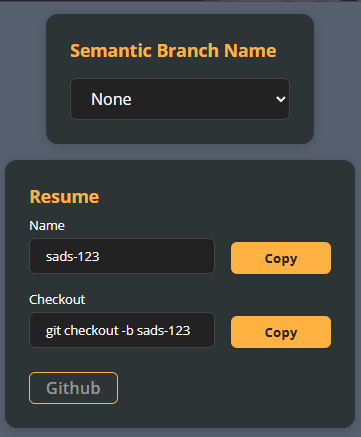

# Jira Extension

Extensão para Google Chrome que facilita a geração automática de nomes de branches Git com base nas tarefas do Jira. Ideal para desenvolvedores que utilizam Jira e Git no dia a dia.

---

## 🇧🇷 Descrição

**Jira Extension** é uma extensão leve para o Chrome que melhora a integração entre Jira e Git, permitindo a criação automática de nomes de branches a partir da issue selecionada no Jira. Isso ajuda a manter um padrão de nomenclatura consistente no seu fluxo de trabalho.

### ✨ Funcionalidades

- 📌 Geração automática de nomes de branch no formato: `ABC-123-minha-descricao`
- ⚡ Evita erros de digitação e agiliza o fluxo de desenvolvimento
- 🧩 Funciona diretamente no Google Chrome, sem dependências externas

### 🛠️ Como usar

1. Acesse a [Jira Extension na Chrome Web Store](https://chrome.google.com/webstore/detail/jira-extension/golgakbdnanapdecbfabaaadfmjpildo) 
2. Clique em **Adicionar ao Chrome**
3. Após a instalação, abra uma tarefa no Jira
4. A extensão irá gerar automaticamente o nome da branch com base na chave da tarefa e título da mesma
5. Use a branch gerada para iniciar seu desenvolvimento!

### 📂 Exemplo de branch gerado

Se estiver na issue `PROJ-456` com o título "Corrigir erro de login", a extensão irá gerar automaticamente:

---

## 🇺🇸 Description

**Jira Extension** is a lightweight Chrome extension that helps generate Git branch names automatically based on the Jira issue you're working on. It streamlines your development workflow and enforces consistent naming.

### ✨ Features

- 📌 Automatically generates Git branch names like: `ABC-123-feature-name`
- ⚡ Avoids typos and saves time during development
- 🧩 Works directly in Google Chrome, no external dependencies

### 🛠️ How to use

1. Go to the [Jira Extension page on Chrome Web Store](https://chrome.google.com/webstore/detail/jira-extension/golgakbdnanapdecbfabaaadfmjpildo) 
2. Click **Add to Chrome**
3. Once installed, open any Jira issue
4. The extension will automatically generate a branch name based on the issue key and title
5. Use the generated branch name to start your development!

### 📂 Example branch name

If you're on issue `PROJ-456` titled "Fix login bug", the extension will generate:

---

